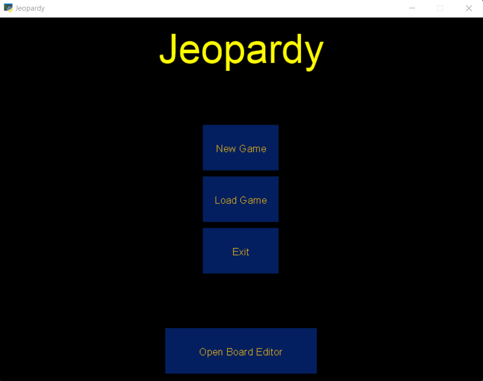

# Clue-Crew
A Jeopardy style game that can receive custom questions and responses.

# Overview
## Game Window

### Starting a New Game
`New Game` __Start a new game of Jeopardy__

1. Click on "New Game" and a new window will pop up. On the new window, select the desired board (.XML file).

2. Select the desired number of teams.

3. Play the game! You are ready to play Jeopardy.

<!-- NEW LINE (SPACE) -->
&nbsp;

### Resuming an Existing Game
`Load Game` __Continue playing a previously created game__

1. Click on "Load Game" and a new window will pop up. On the new window, select the desired board (.jpd file).

2. The board will load and you can continue playing!

<!-- NEW LINE (SPACE) -->
&nbsp;
## Board Editor

<!-- NEW LINE (SPACE) -->
&nbsp;

### Creating a Board
`Create New Board` __Create a custom board to play the game__

1. Click on "Create New Board"

2. Fill the entry boxes and click "Add Question" to add a new entry. Optionally, you can click Yes/No to double the amount of points for the current question.

3. When done adding question. Click on "Save" to save the board as a new file or replace an existing file. __MAKE SURE__ to __INCLUDE .xml__ at the end of the file name if you are creating a new file.

<!-- NEW LINE (SPACE) -->
&nbsp;

### Editing a Board
`Edit Existing Board` __Modify the values of an existing board__

The board editor has two modes for editing a board, the __Regular Editor__ and the __Advanced Editor__. Click on "Edit Existing Board" to start.

### Regular Editor
This is the default mode, to edit a board, click on "Load File", and select a board file (.XML file). After that, type a category in the category entry box and click "Search." If the category exists, the questions under that category will be displayed.

When done making the desired changes, click on "Save" and the changes will be saved into the selected file.

### Advanced Editor
Alternatively, you can use the advanced editor to visualize the entire file. To enter the advanced editor, click on the "Advanced Editor" button located on the bottom right of the regular editor.

Similar to the regular editor, click on "Load File" and select the file you want to modify (.XML file). After making a selection, the contents of the file will be displayed and you can edit them. Optionally, you can resize the window to visualize the text better.

When done making the desired changes, click on "Save" and a new window will pop up. You can save the file as a new file or overwrite an existing file. __MAKE SURE__ to __INCLUDE .xml__ at the end of the file name if you are creating a new file.

# Development Environment
### Tools to Develop Software
* Visual Studio Code
* Microsoft Teams
* Git & GitHub

### Programming Language
* Python 3.10.2
* Tkinter
* Arcade

# Collaborators
* [Rodrigo Rodriguez](https://github.com/RodBuild)
* Kyle Bunn
* CJ Bialorucki
* Corbyn Coffin

# Useful Websites
* [Tkinter Documentation](https://docs.python.org/3/library/tk.html)
* [Tkinter Tutorial](https://www.tutorialspoint.com/python3/python_gui_programming.htm)
* [Arcade Documentation](https://api.arcade.academy/en/latest/arcade.html)
* [Arcade Tutorials](https://api.arcade.academy/en/latest/examples/index.html#example-code) 

# Future Work
* Implementation of additional Jeopardy aspects (Daily Double, Final Jeopardy, etc.)
* Integration of existing Jeopardy question database
